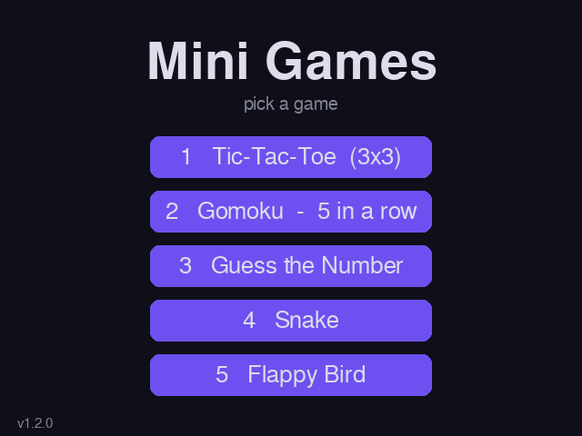

# Mini Games Collection

A collection of five classic games built with **Python** and **Pygame** and available from a single application window.

Included games:

1. **Tic-Tac-Toe** — 3×3 board, local multiplayer or AI opponent
2. **Gomoku** — five-in-a-row on a large scrollable board, local multiplayer or AI opponent
3. **Guess the Number** — guess a randomly selected number between 1 and 100
4. **Snake** — classic grid-based gameplay with increasing speed
5. **Flappy Bird** — navigate through pipes by controlling the bird's flight


---

## Screenshots



---

## Requirements

- Python 3.8 or later
- Pygame 2.x

Install Pygame with:

```bash
pip install pygame
```

---

## Running the Application

Run the following command from the project directory:

```bash
python main.py
```

The application window is resizable, and each game adjusts its layout automatically. The minimum supported window size is 640×480.

---

## Controls

| Game | Controls |
|---|---|
| Tic-Tac-Toe | Mouse click |
| Gomoku | Mouse click to place a stone · Arrow keys or mouse wheel to pan · **R** to restart after a win |
| Guess the Number | Keyboard input · Enter or the confirmation button to submit |
| Snake | Arrow keys or WASD |
| Flappy Bird | Space, Up, W, or mouse click to flap |

---

## Game Modes and AI Difficulty

Tic-Tac-Toe and Gomoku support local multiplayer and three AI difficulty levels.

| Mode | Description |
|---|---|
| 2 Players | Local two-player mode without an AI opponent |
| Easy | Selects mostly random nearby moves and may overlook immediate threats |
| Medium | Uses stronger move selection but occasionally chooses a suboptimal move |
| Hard | Uses the strongest available strategy: minimax for Tic-Tac-Toe and heuristic search for Gomoku |

After a win in Gomoku, the five winning stones are highlighted with a pulsing gold effect.

---

## Version Check

On startup, the application checks GitHub for a newer release.

When an update is available, a notification is displayed at the bottom of the main menu. The latest version can be downloaded from the [Releases](../../releases) page.

---

## Project Structure

```text
main.py          — application entry point, main menu, and version check
shared.py        — shared colours, fonts, base Game class, and utility functions

game_ttt.py      — Tic-Tac-Toe
game_gomoku.py   — Gomoku
game_guess.py    — Guess the Number
game_snake.py    — Snake
game_flappy.py   — Flappy Bird
```

Each game extends `shared.Game`, which provides the main application loop, window event handling, resize handling, and the Back button.

Individual games implement the following methods:

- `handle_event`
- `update`
- `draw`
- `on_resize`

---

## Project Status

> [!IMPORTANT]
> This project is no longer actively developed or maintained.
> The repository is preserved for reference and archival purposes.

---

## License

This project is licensed under the MIT License. See the [LICENSE](LICENSE) file for details.
