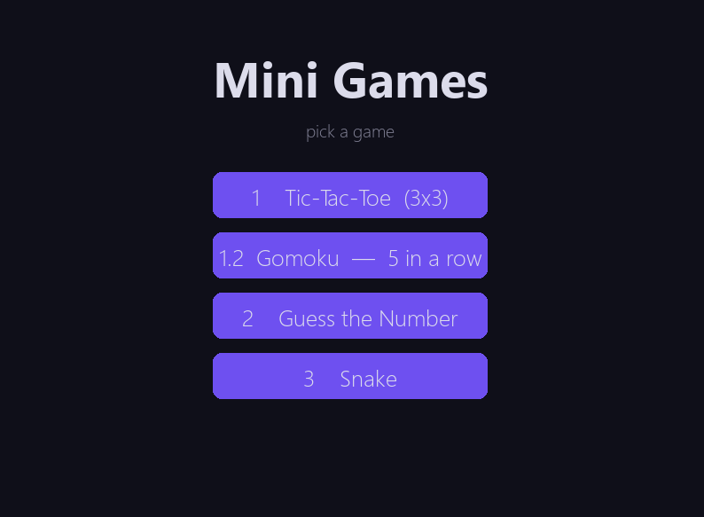
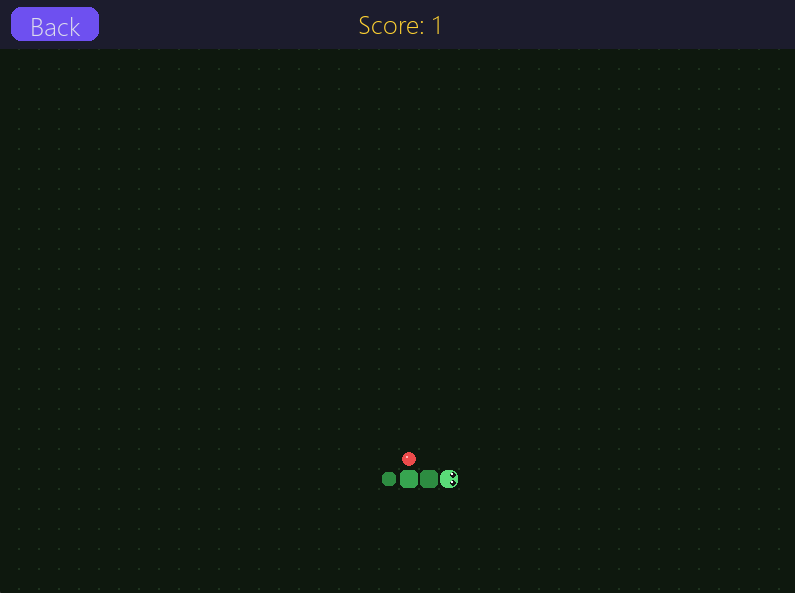
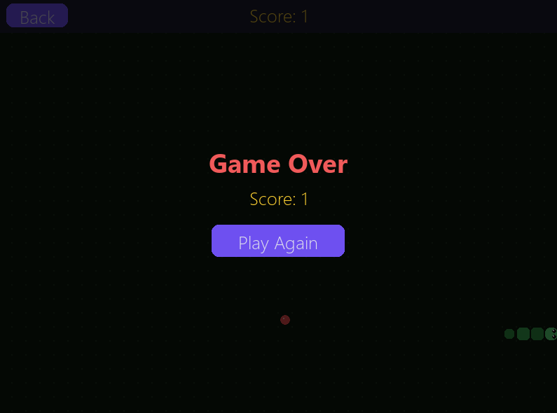

# Mini Games Collection 🎮

A small collection of classic games in one window, built with **Python + Pygame**.

```
1  – Tic-Tac-Toe      (3×3 — two players or vs AI)
2  – Gomoku           (5 in a row on a big scrollable board — two players or vs AI)
3  – Guess the Number (computer picks 1–100, you guess)
4  – Snake            (classic; grid field, scaly visuals, speed increases as you eat)
```


---

## Screenshots





---

## Requirements

- Python 3.8+
- Pygame 2.x

```bash
pip install pygame
```

## Run

```bash
python main.py
```

---

## Controls

| Game           | Controls                                                              |
|----------------|-----------------------------------------------------------------------|
| Tic-Tac-Toe    | Mouse click                                                           |
| Gomoku         | Mouse click to place · Arrow keys / scroll wheel to pan · **R** to restart after win |
| Guess Number   | Type on keyboard · Enter or button to confirm                         |
| Snake          | Arrow keys or WASD                                                    |

---

## AI difficulty levels (Tic-Tac-Toe & Gomoku)

Both games ask you to pick a mode before starting:

| Mode      | Behaviour                                                               |
|-----------|-------------------------------------------------------------------------|
| 2 Players | Local two-player, no AI                                                 |
| Easy      | Picks random nearby moves — makes obvious mistakes                      |
| Medium    | Plays smart most of the time, but slips up ~40 % of moves               |
| Hard      | Plays as well as possible (minimax for TTT, deep heuristic for Gomoku)  |

When you win in Gomoku the 5 winning stones are highlighted with a pulsing gold glow.

---

## Version check

On startup the game silently checks GitHub for a newer release.
If an update is available a gold notification appears at the bottom of the main menu.
To update — download the latest version from the [Releases](../../releases) page.

---

## Project structure

```
main.py          — entry point, main menu, version check
shared.py        — colours, fonts, and shared draw helpers

game_ttt.py      — Game 1: Tic-Tac-Toe
game_gomoku.py   — Game 2: Gomoku (5 in a row)
game_guess.py    — Game 3: Guess the Number
game_snake.py    — Game 4: Snake
```

---

## License

MIT — do whatever you want with it.